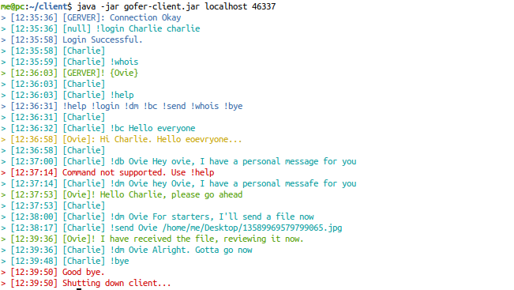
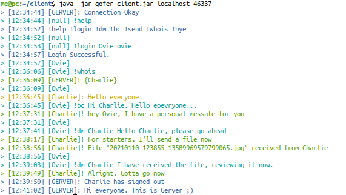

# gofer-client

The client for gofer project, a client-server chat system built with Java.

## Dependency
See pom.xml file

## How To Build
Use maven

## Features
- Broadcasting a message to all connected clients
- Sending a message to single connected client
- File transfer (up to 120MB) to single connected client
- Multi-threading (but requires some improvment)

## Todo
- Improve multi-threading
- Proper message encryption layer for messages
- Proper encryption layer for file transfer
- Received file integrity verification
- Graphical User Interface

## Screnshot

